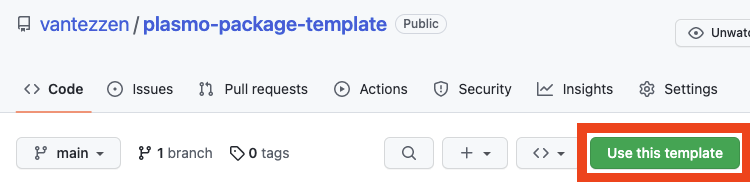

# plasmo-package-template

This template can be used to easily develop third-party packages for the [plasmo webextension framework](https://www.plasmo.com/).

> As with plasmo itself, this template is alpha software - expect bugs!

## Features

- TSX/JSX support
- Typescript support
- Example extension to test your package in the browser
- Jest integration

## Usage

1. Click the "Use this template" button on this repository to create a template fork

   

2. Clone your fork onto your local machine
3. Customize the name, description, author and version in `package.json` and optionally `example/package.json`
4. Install dependencies using `pnpm install`

## Structure

- `src/index.ts`

This file will be you extension's entry file. Please export all your public exports from there as it will be the only file that is build on publish.

- `example/`

This example extension can be used to test your package in the browser

- `dist/`

Your final, build files will be stored here

## Commands

- `pnpm run dev`

Runs the development build, jest test watcher and example extension builder in watch mode

- `pnpm run dev:compile`

Runs the Typescript compiler in watch mode

- `pnpm run dev:test`

Runs Jest in watch mode

- `pnpm run dev:example`

Runs `plasmo dev` for the example extension in `/dev`

- `pnpm run build`

Runs the Typescript build

- `pnpm run test`

Runs Jest without watch mode (e.g. for CIs)

## TODO

- [ ] Add Typescript import alias to allow `import ... from "@"` instead of `import ... from "../src"` in the example extension
- [ ] Verify build + publish works

## Attribution

This template is based on plasmo's [storage library](https://github.com/PlasmoHQ/storage).

## License

[MIT](./LICENSE)
